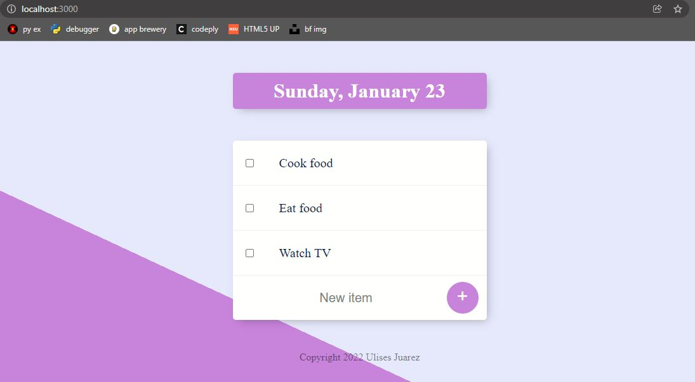
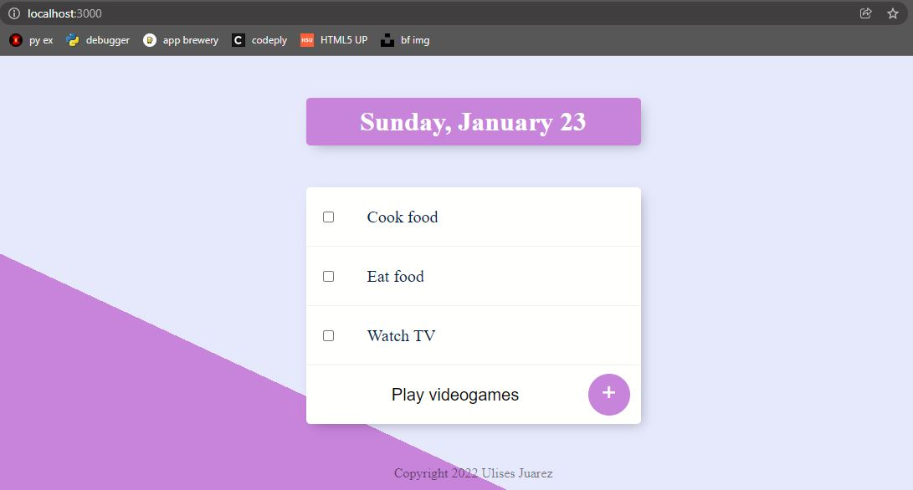
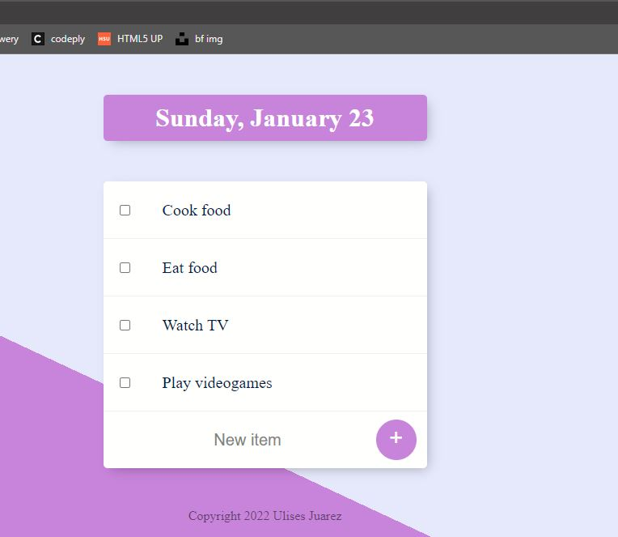
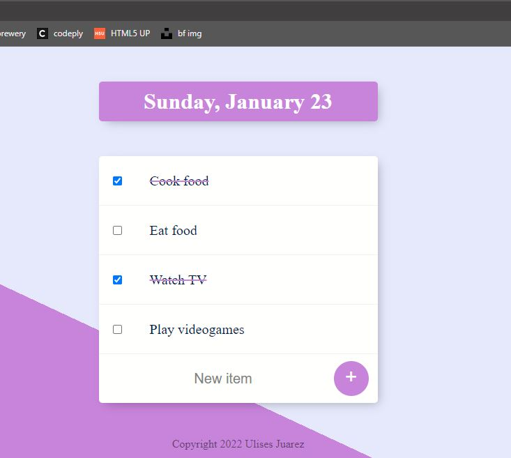
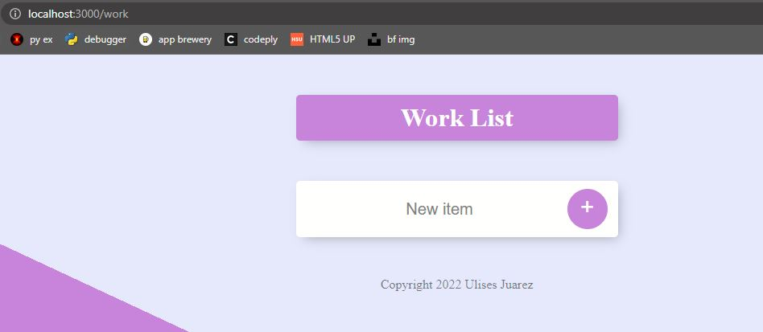

# ToDoList
Aplicación web que me permite ver la lista de tareas que me faltan por hacer. 

----

Al correr la aplicación en la ruta "/" por defecto nos aparece lo siguiente

Nos aparece una lista de tareas pero podemos agregar más

Una vez que le damos al botón + se añade esa tarea a la lista anterior

Podemos marcar las tareas que ya hemos realizado como se muestra a continuación

De manera auxiliar en la ruta "/work" podemos agregar más tareas

